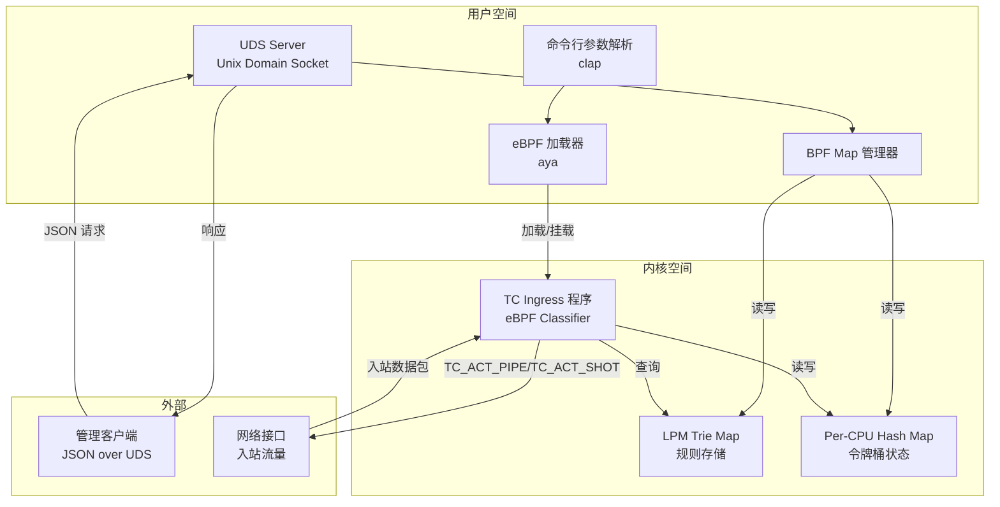
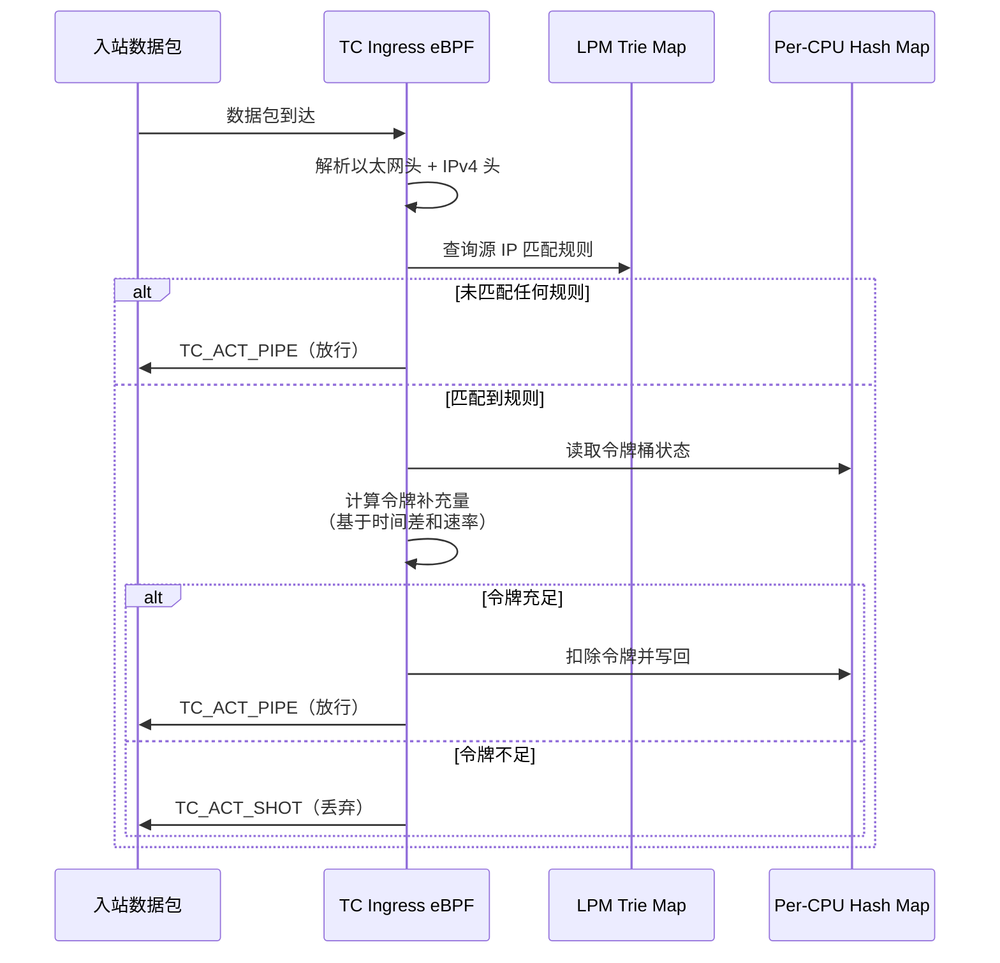

# 设计文档：eBPF 下载限速器

## 概述

本系统是一个基于 [aya](https://aya-rs.dev/) 框架的 eBPF 下载限速器（QoS），采用 Rust 语言实现。系统分为三个核心层：

1. **数据面（Data Plane）**：运行在内核空间的 eBPF TC（Traffic Control）程序，挂载到网络接口的 ingress 钩子，对入站数据包执行令牌桶限速逻辑。
2. **控制面（Control Plane）**：运行在用户空间的 Rust 程序，负责加载 eBPF 程序、管理 BPF Map、监听 Unix Domain Socket 控制指令。
3. **共享层（Common）**：在用户空间和 eBPF 程序之间共享的数据结构定义。

系统使用 LPM Trie BPF Map 实现 IP/CIDR 最长前缀匹配，使用 Per-CPU Hash Map 存储令牌桶状态以减少多核竞争。控制面通过 Unix Domain Socket + JSON 协议接收管理指令，支持动态添加、删除和查询限速规则。

## 架构

### 整体架构图



### 数据流



## 组件与接口

### 项目 Workspace 结构

```
qos/
├── Cargo.toml                    # workspace 根配置
├── qos-ebpf/                     # eBPF 程序 crate
│   ├── Cargo.toml
│   ├── rust-toolchain.toml
│   └── src/
│       └── main.rs               # TC ingress eBPF 程序
├── qos-common/                   # 共享数据结构 crate
│   ├── Cargo.toml
│   └── src/
│       └── lib.rs                # BPF Map key/value 类型定义
└── qos/                          # 用户空间程序 crate
    ├── Cargo.toml
    ├── build.rs                  # aya-build 编译 eBPF
    └── src/
        ├── main.rs               # 入口：CLI 解析、eBPF 加载、UDS 启动
        ├── uds.rs                # Unix Domain Socket 服务
        └── map_manager.rs        # BPF Map 管理封装
```

### 组件详细设计

#### 1. qos-common（共享 crate）

此 crate 定义用户空间和 eBPF 程序共享的数据结构，必须同时兼容 `no_std` 环境。

```rust
// LPM Trie 的 Key 结构
#[repr(C)]
pub struct LpmKeyV4 {
    pub prefix_len: u32,  // CIDR 前缀长度（如 /24 = 24）
    pub addr: u32,        // IPv4 地址（网络字节序）
}

// 限速规则配置（LPM Trie 的 Value）
#[repr(C)]
pub struct RateLimitConfig {
    pub rate: u64,        // 速率（字节/秒）
    pub burst: u64,       // 突发容量（字节）
}

// 令牌桶状态（Per-CPU Hash Map 的 Value）
#[repr(C)]
pub struct TokenBucketState {
    pub tokens: u64,          // 当前可用令牌数（字节）
    pub last_refill_ns: u64,  // 上次补充时间（纳秒，bpf_ktime_get_ns）
}
```

#### 2. qos-ebpf（eBPF 程序 crate）

TC ingress classifier 程序，核心逻辑：

- 解析以太网帧头和 IPv4 头，提取源 IP 地址
- 在 LPM Trie 中查找匹配的限速规则
- 读取对应的令牌桶状态，基于时间差补充令牌
- 判断令牌是否充足，决定放行或丢弃

关键接口：
- `#[classifier] fn tc_ingress(ctx: TcContext) -> i32`：TC 入口函数
- BPF Maps：
  - `RULES: LpmTrie<LpmKeyV4, RateLimitConfig>`：规则存储
  - `TOKEN_STATES: PerCpuHashMap<u32, TokenBucketState>`：令牌桶状态

#### 3. qos（用户空间 crate）

##### main.rs - 程序入口

- 使用 `clap` 解析命令行参数（`--iface`、`--socket-path`）
- 使用 `aya` 加载 eBPF 字节码并挂载到 TC ingress
- 启动 UDS 服务器监听管理指令
- 处理 SIGINT/SIGTERM 信号实现优雅退出

##### uds.rs - Unix Domain Socket 服务

- 在指定路径创建 UDS 并监听连接
- 接收 JSON 格式的请求，解析命令类型
- 调用 MapManager 执行规则操作
- 返回 JSON 格式的响应
- 退出时删除 socket 文件

##### map_manager.rs - BPF Map 管理器

- 封装对 LPM Trie 和 Per-CPU Hash Map 的读写操作
- 提供 `add_rule`、`delete_rule`、`list_rules` 方法
- 处理 CIDR 解析和 LpmKeyV4 构造

### JSON 控制协议

#### 请求格式

```json
// 添加规则
{"command": "add", "ip": "192.168.1.0/24", "rate": 1048576, "burst": 2097152}

// 删除规则
{"command": "delete", "ip": "192.168.1.0/24"}

// 列出规则
{"command": "list"}
```

#### 响应格式

```json
// 成功响应
{"status": "ok", "data": null}

// 列出规则响应
{"status": "ok", "data": [{"ip": "192.168.1.0/24", "rate": 1048576, "burst": 2097152}]}

// 错误响应
{"status": "error", "message": "invalid CIDR format"}
```

### 依赖关系

| crate | 关键依赖 | 用途 |
|-------|---------|------|
| qos | aya, tokio, clap, serde, serde_json, anyhow, log, env_logger | 用户空间主程序 |
| qos-ebpf | aya-ebpf, aya-log-ebpf, network-types | eBPF 内核程序 |
| qos-common | (no_std 兼容，无外部依赖) | 共享数据结构 |

构建依赖：`aya-build`（在 qos crate 的 build.rs 中使用）

## 数据模型

### BPF Map 设计

#### 1. RULES - LPM Trie Map

| 属性 | 值 |
|------|-----|
| 类型 | BPF_MAP_TYPE_LPM_TRIE |
| Key | `LpmKeyV4 { prefix_len: u32, addr: u32 }` |
| Value | `RateLimitConfig { rate: u64, burst: u64 }` |
| 最大条目数 | 1024 |
| 标志 | BPF_F_NO_PREALLOC |

LPM Trie 自动支持最长前缀匹配：当数据包源 IP 同时匹配 `10.0.0.0/8` 和 `10.0.0.1/32` 时，自动选择 `/32` 规则。

#### 2. TOKEN_STATES - Per-CPU Hash Map

| 属性 | 值 |
|------|-----|
| 类型 | BPF_MAP_TYPE_PERCPU_HASH |
| Key | `u32`（IPv4 地址，与 LPM 匹配结果对应） |
| Value | `TokenBucketState { tokens: u64, last_refill_ns: u64 }` |
| 最大条目数 | 1024 |
| 标志 | BPF_F_NO_PREALLOC |

使用 Per-CPU Hash Map 的原因：每个 CPU 核心维护独立的令牌桶状态副本，避免多核并发访问时的锁竞争。这意味着实际限速精度是"近似"的（每个 CPU 独立计算），但在高性能场景下这是可接受的权衡。

### 令牌桶算法

```
令牌补充逻辑（每次数据包到达时执行）：
  now = bpf_ktime_get_ns()
  elapsed_ns = now - state.last_refill_ns
  new_tokens = elapsed_ns * config.rate / 1_000_000_000
  state.tokens = min(state.tokens + new_tokens, config.burst)
  state.last_refill_ns = now

判定逻辑：
  if state.tokens >= packet_size:
      state.tokens -= packet_size
      return TC_ACT_PIPE  // 放行
  else:
      return TC_ACT_SHOT  // 丢弃
```

### 命令行参数模型

| 参数 | 类型 | 默认值 | 说明 |
|------|------|--------|------|
| `--iface` | String | （必填） | 网络接口名称 |
| `--socket-path` | String | `/var/run/qos.sock` | UDS 监听路径 |

### JSON 请求/响应模型

```rust
// 请求
#[derive(Deserialize)]
#[serde(tag = "command")]
pub enum Request {
    #[serde(rename = "add")]
    Add { ip: String, rate: u64, burst: u64 },
    #[serde(rename = "delete")]
    Delete { ip: String },
    #[serde(rename = "list")]
    List,
}

// 响应
#[derive(Serialize)]
pub struct Response {
    pub status: String,          // "ok" 或 "error"
    #[serde(skip_serializing_if = "Option::is_none")]
    pub data: Option<serde_json::Value>,
    #[serde(skip_serializing_if = "Option::is_none")]
    pub message: Option<String>,
}

// 规则信息（用于 list 响应）
#[derive(Serialize)]
pub struct RuleInfo {
    pub ip: String,
    pub rate: u64,
    pub burst: u64,
}
```


## 正确性属性

*属性（Property）是指在系统所有有效执行中都应成立的特征或行为——本质上是对系统应做什么的形式化陈述。属性是人类可读规格说明与机器可验证正确性保证之间的桥梁。*

以下属性适用于本系统中的纯函数逻辑（令牌桶算法、CIDR 解析、JSON 序列化、规则管理）。eBPF 加载/挂载、内核交互等基础设施行为通过集成测试和冒烟测试覆盖。

### 属性 1：令牌消耗决策正确性

*对于任意*有效的令牌桶状态（tokens, last_refill_ns）和任意数据包大小 packet_size：
- 若 tokens >= packet_size，则处理后令牌数应减少 packet_size，且决策为放行（TC_ACT_PIPE）
- 若 tokens < packet_size，则令牌数不变，且决策为丢弃（TC_ACT_SHOT）

**验证需求：2.2, 2.3**

### 属性 2：令牌补充计算正确性

*对于任意*有效的速率 rate（字节/秒）、突发容量 burst、当前令牌数 current_tokens 和经过时间 elapsed_ns（纳秒），补充后的令牌数应等于 `min(current_tokens + elapsed_ns * rate / 1_000_000_000, burst)`。

**验证需求：2.4, 2.6**

### 属性 3：令牌数量不变量

*对于任意*有效的令牌桶配置（rate, burst）和任意操作序列（补充、消耗的任意组合），令牌数量在任意时刻都不应超过 burst 上限。

**验证需求：2.6**

### 属性 4：CIDR 字符串解析正确性

*对于任意*有效的 IPv4 CIDR 字符串（如 "10.0.0.0/8"、"192.168.1.1/32"），解析为 LpmKeyV4 后，prefix_len 应等于 CIDR 的前缀长度，addr 应等于网络地址的网络字节序表示。反向格式化后应得到等价的 CIDR 字符串。

**验证需求：4.4, 3.1, 3.2**

### 属性 5：规则管理一致性

*对于任意*一组有效的限速规则集合，依次添加所有规则后调用 list 应返回恰好该集合中的所有规则；删除其中一条规则后调用 list 应返回原集合减去被删除规则的结果。

**验证需求：4.5, 4.6**

### 属性 6：JSON 序列化往返

*对于任意*有效的 Request 对象，序列化为 JSON 字符串后再反序列化应得到与原始对象等价的值。对于任意有效的 Response 对象同理。

**验证需求：4.8**

### 属性 7：无效命令错误处理

*对于任意*格式错误的 JSON 字符串或包含未知 command 字段的 JSON 对象，系统应返回 status 为 "error" 且包含非空 message 字段的响应。

**验证需求：4.7**

## 错误处理

### eBPF 加载与挂载错误

| 错误场景 | 处理方式 |
|----------|---------|
| 权限不足（非 root） | 输出 "Permission denied: eBPF requires root privileges" 并退出（exit code 1） |
| 内核不支持 eBPF/TC | 输出内核版本要求信息并退出（exit code 1） |
| 网络接口不存在 | 输出 "Interface '{name}' not found" 并退出（exit code 1） |
| TC qdisc 添加失败 | 忽略（clsact 可能已存在），记录 warning 日志 |

### UDS 服务错误

| 错误场景 | 处理方式 |
|----------|---------|
| Socket 路径已被占用 | 尝试删除旧文件后重新创建；若仍失败则退出 |
| 客户端连接断开 | 记录 debug 日志，继续监听新连接 |
| JSON 解析失败 | 返回 `{"status": "error", "message": "invalid JSON: ..."}` |
| 未知命令 | 返回 `{"status": "error", "message": "unknown command: ..."}` |
| CIDR 格式无效 | 返回 `{"status": "error", "message": "invalid CIDR format: ..."}` |
| rate 或 burst 为 0 | 返回 `{"status": "error", "message": "rate and burst must be positive"}` |

### BPF Map 操作错误

| 错误场景 | 处理方式 |
|----------|---------|
| Map 写入失败（容量满） | 返回 `{"status": "error", "message": "rule limit reached (max 1024)"}` |
| Map 删除不存在的 key | 返回 `{"status": "error", "message": "rule not found: ..."}` |
| Map 读取失败 | 记录 error 日志，返回错误响应 |

### eBPF 数据面错误

| 错误场景 | 处理方式 |
|----------|---------|
| 非 IPv4 数据包 | 直接放行（TC_ACT_PIPE） |
| 以太网头/IP 头解析失败 | 放行数据包（TC_ACT_PIPE），避免误丢 |
| LPM Trie 查询无匹配 | 放行数据包（TC_ACT_PIPE） |
| Token 状态读取失败 | 放行数据包（TC_ACT_PIPE），初始化新状态 |

### 信号处理

- **SIGINT / SIGTERM**：触发优雅退出流程
  1. 停止 UDS 监听，删除 socket 文件
  2. 从 TC ingress 卸载 eBPF 程序
  3. 释放 BPF Map 资源
  4. 以 exit code 0 退出

## 测试策略

### 双重测试方法

本项目采用单元测试 + 属性测试的双重策略：

- **单元测试**：验证具体示例、边界条件和错误处理
- **属性测试**：验证跨所有输入的通用属性

### 属性测试（Property-Based Testing）

**测试库**：[proptest](https://crates.io/crates/proptest)（Rust 生态中成熟的 PBT 库）

**配置要求**：
- 每个属性测试最少运行 100 次迭代
- 每个测试必须通过注释引用设计文档中的属性编号
- 标签格式：`Feature: ebpf-download-rate-limiter, Property {N}: {属性描述}`

**属性测试覆盖范围**：

| 属性 | 测试目标 | 生成器策略 |
|------|---------|-----------|
| 属性 1：令牌消耗决策 | `process_packet()` 纯函数 | 随机 tokens (0..u64), 随机 packet_size (1..65535) |
| 属性 2：令牌补充计算 | `refill_tokens()` 纯函数 | 随机 rate, burst, current_tokens, elapsed_ns |
| 属性 3：令牌数量不变量 | 操作序列后的状态检查 | 随机操作序列（refill/consume 交替） |
| 属性 4：CIDR 解析 | `parse_cidr()` / `format_cidr()` | 随机 IPv4 地址 + 随机前缀长度 (0..32) |
| 属性 5：规则管理 | MapManager 的 add/delete/list | 随机规则集合 |
| 属性 6：JSON 往返 | Request/Response serde | 随机 Request/Response 实例 |
| 属性 7：无效命令 | 命令解析错误路径 | 随机无效 JSON 字符串 + 随机未知命令 |

### 单元测试覆盖范围

| 模块 | 测试重点 |
|------|---------|
| CLI 解析 | `--iface` 必填验证、`--socket-path` 默认值、无效参数 |
| CIDR 解析 | 具体示例：`10.0.0.1/32`、`192.168.0.0/16`、`0.0.0.0/0`、无效格式 |
| JSON 协议 | 各命令的具体请求/响应示例 |
| 令牌桶 | 边界条件：tokens=0、tokens=burst、packet_size=0、elapsed=0 |
| 错误处理 | 各种错误场景的具体响应验证 |

### 集成测试

集成测试需要 Linux 环境和 root 权限，覆盖：

- eBPF 程序加载和 TC 挂载/卸载
- BPF Map 用户空间写入后内核空间可见
- UDS 端到端通信（连接、发送命令、接收响应）
- 完整限速流程（添加规则 → 发送数据包 → 验证限速效果）
