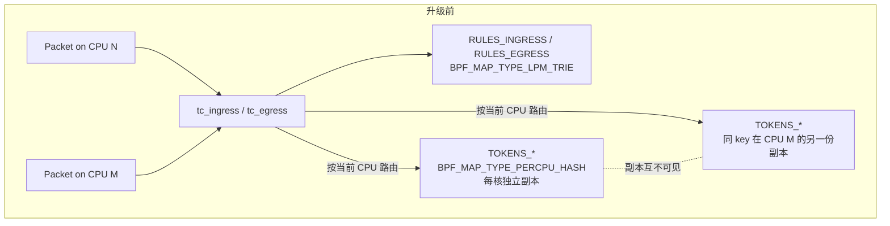
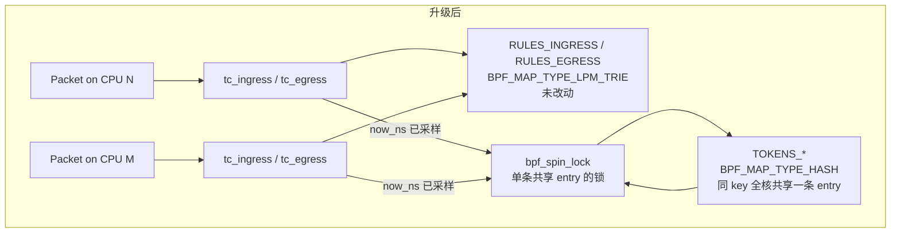
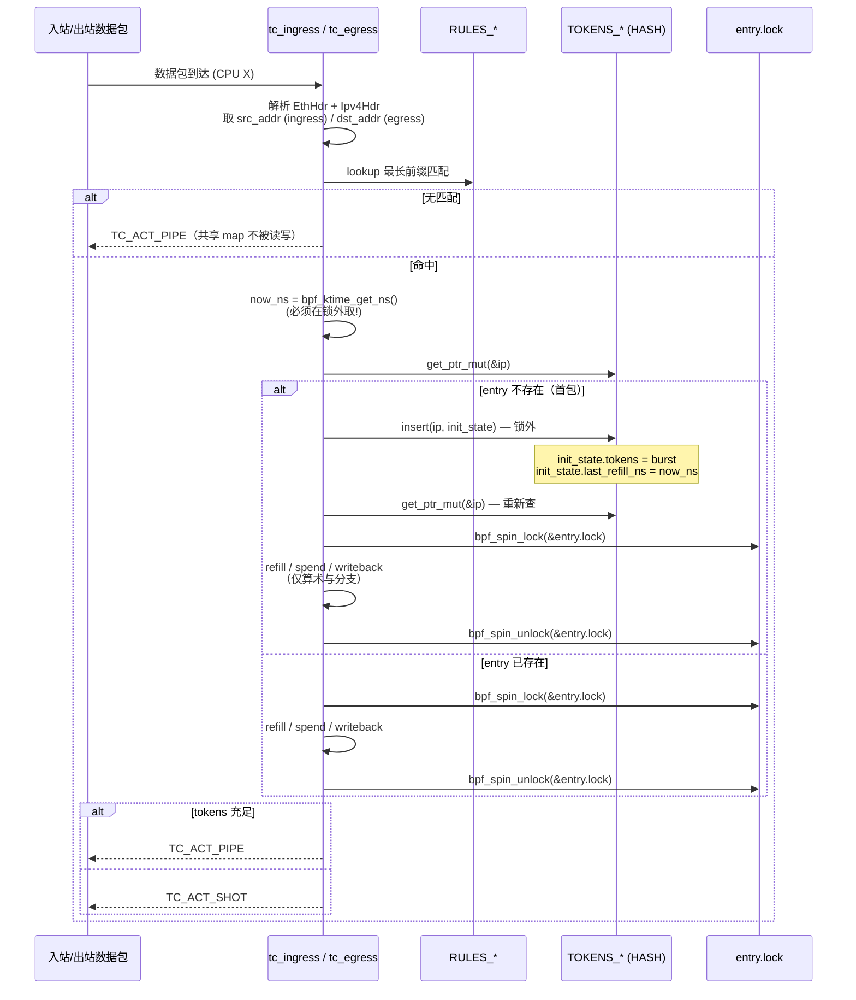

# 设计文档：eBPF 限速器准确性升级（共享条目 + bpf_spin_lock）

## Overview

本设计是对既有 `ebpf-download-rate-limiter` 数据面的**最小侵入式准确性升级**：

- **改动一**：将 ingress（`tc_ingress`）与 egress（`tc_egress`）两条数据路径上保存令牌桶状态的 BPF Map，从 `BPF_MAP_TYPE_PERCPU_HASH` 改为 `BPF_MAP_TYPE_HASH`，使同一 IP 在所有 CPU 之间**共享同一份**令牌桶条目。
- **改动二**：在 `TokenBucketState` 内嵌入一个 `bpf_spin_lock` 字段，使"读取 → 补充 → 判定 → 写回"四步在内核态被原子地序列化，消除多核并发更新带来的丢失更新与速率多倍放大问题。

**不改动**的部分（以保证 Requirement 4 的向后兼容）：

- UDS 控制协议（`add` / `delete` / `list`，`direction`、`status`、`data`、`message` 字段语义与形状）
- `MapManager::add_rule` / `delete_rule` / `list_rules` 的 Rust API 与回滚语义
- `RULES_INGRESS` / `RULES_EGRESS` 两个 `LpmTrie` 的类型、键值、容量上限（1024）与 `BPF_F_NO_PREALLOC` 标志
- `qos` 二进制的 `--iface` / `--socket-path` 命令行参数与 `/var/run/qos.sock` 默认值
- 现有客户端（`socat` 命令、`scripts/recv.py`、`scripts/test-upload.sh`、`deploy/qos-load-rules`）所发送的 JSON 字节流

**准确性目标**（来自 `requirements.md` Glossary 中 `Accuracy_Tolerance`）：在单核与跨核两种发送侧场景下，单条规则的 `Effective_Rate` 在尾部 10 秒窗口内与 `Configured_Rate` 的偏差均落在 **±2%** 之内。

### 升级动机回顾

`PerCpuHashMap` 为每个 CPU 维持独立的 `TokenBucketState` 副本。eBPF 程序在某 CPU 上运行时只能看见**该 CPU 的副本**，因此当同一 IP 的流量被 RPS/RSS、softirq 跨核唤醒等机制分派到 N 个核时，N 个独立的桶各自补充与消耗，整体放行速率近似于 `N × Configured_Rate`。线上观察到 1 MB/s 配置实测 ~4 MB/s，恰对应 4 核分散。本升级用单一共享条目消除该效应。

### 为什么需要锁

将 map 改为共享后，数据面在单条 entry 上的临界区会从"per-CPU 独占"退化为"跨 CPU 竞争"。`refill → spend → write-back` 这一序列不是单条原子指令，纯共享 + 朴素读写会出现：
- **丢失更新（lost update）**：CPU A 与 CPU B 同时读到 `tokens = 100`，各自扣 `1500`，写回后只扣了 `1500` 而非 `3000`，结果是放行了双倍流量。
- **重复补充（double credit）**：A、B 都看到 `last_refill_ns` 是旧值，都按"自旧时刻起的全部 elapsed"补充令牌。

`bpf_spin_lock` 是内核 BPF 子系统为此场景提供的原语：`get_ptr_mut → bpf_spin_lock → 算术 → bpf_spin_unlock` 把整个 RMW 区段串行化。

## Architecture

### 升级前 vs 升级后





### 单包数据流（升级后）



注意 `bpf_ktime_get_ns()` 的调用**严格放在 `bpf_spin_lock()` 之前**——见下文 Verifier 兼容性一节给出的依据。

## Components and Interfaces

### 受影响文件清单

| 文件 | 改动类别 | 说明 |
|------|---------|------|
| `qos-common/src/lib.rs` | 修改 | `TokenBucketState` 增加 `lock` 字段；新增 `process_packet_locked` 风格的辅助 API（不替换现有的 `process_packet` 纯函数，便于属性测试继续覆盖纯逻辑） |
| `qos-ebpf/src/main.rs` | 修改 | `TOKENS_INGRESS` / `TOKENS_EGRESS` 类型从 `PerCpuHashMap` 改为 `HashMap`；`try_ingress` / `try_egress` 改为"锁外取时间 → 必要时初始化 → 锁内 RMW"流程 |
| `qos/src/main.rs` | 微调 | 为 `tc_ingress` / `tc_egress` 的加载/挂载错误路径补充明确的程序名标签与 verifier 消息透传（Requirement 2.5） |
| `qos/src/map_manager.rs` | **不改动** | 仅持有 `RULES_*` 两个 LpmTrie，未改动 |
| `qos/src/protocol.rs` | **不改动** | 协议字段、解析、序列化均不动 |
| `qos/src/uds.rs` | **不改动** | UDS 处理路径不变 |
| `scripts/recv.py` / `scripts/test-upload.sh` / `deploy/qos-load-rules` | **不改动** | 客户端与运维脚本兼容 |

### `qos-ebpf` 数据面组件

#### 共享 map 声明

```rust
// 用 BPF_MAP_TYPE_HASH 替换原 PerCpuHashMap，
// max_entries 与 flag 保持不变（容量 1024）。
#[map]
static TOKENS_INGRESS: HashMap<u32, TokenBucketState> =
    HashMap::with_max_entries(1024, 0);

#[map]
static TOKENS_EGRESS: HashMap<u32, TokenBucketState> =
    HashMap::with_max_entries(1024, 0);
```

`HashMap` 来自 `aya_ebpf::maps::HashMap`，编译为 `BPF_MAP_TYPE_HASH`。`aya-ebpf 0.1.1` 的实现已确认提供 `get_ptr_mut`、`insert`、`remove` 三个 API（参见 `aya-ebpf-0.1.1/src/maps/hash_map.rs`）。

#### 数据面主循环（伪代码）

```rust
#[inline(always)]
fn try_one(
    map: &HashMap<u32, TokenBucketState>,
    ip: u32,
    config: &RateLimitConfig,
    packet_len: u64,
) -> Result<i32, ()> {
    // 1. 时间采样必须在锁外。
    let now_ns = unsafe { bpf_ktime_get_ns() };

    // 2. 首包路径：lookup miss 则用初值 insert。insert 会拷贝整个
    //    value（包括 lock 字段的 0 初值）到 map 内部分配的 slot 中。
    if map.get_ptr(&ip).is_none() {
        let init = TokenBucketState {
            lock: bpf_spin_lock { val: 0 },
            tokens: config.burst,
            last_refill_ns: now_ns,
        };
        // 忽略错误：竞态下他核可能先一步 insert，此处 BPF_ANY 即可覆盖。
        let _ = map.insert(&ip, &init, 0);
    }

    // 3. 锁内 RMW。
    let ptr = match map.get_ptr_mut(&ip) {
        Some(p) => p,
        None => return Ok(TC_ACT_PIPE), // 极端情况下仍 miss(LRU 清理)，放行不加锁
    };
    let state = unsafe { &mut *ptr };

    let allowed: bool;
    unsafe {
        bpf_spin_lock(&mut state.lock as *mut _);

        // 仅算术、分支、字段读写 —— 严禁任何 helper 调用。
        // 把现有 refill_tokens + 扣减逻辑内联展开（不调用辅助函数,
        // 即使是 #[inline(always)] 也要保证 LLVM 实际把代码内联,
        // 否则 verifier 会把它当作 BPF-to-BPF call 拒绝)。
        refill_inline(state, config, now_ns);
        if state.tokens >= packet_len {
            state.tokens -= packet_len;
            allowed = true;
        } else {
            allowed = false;
        }

        bpf_spin_unlock(&mut state.lock as *mut _);
    }

    if allowed { Ok(TC_ACT_PIPE) } else { Ok(TC_ACT_SHOT) }
}
```

**关键决策**：把 `refill_tokens` 的算术展开为锁内的内联代码而不是调用 `state.process_packet(..)`。`process_packet` 已经是 `#[inline(always)]`，但**`inline(always)` 是 rustc 的请求而非保证**——若优化级别或链接时优化未真正内联，编译产物中会出现 `BPF_CALL` 指令，verifier 会以"function call inside spin-locked region"拒绝。展开为单一基本块的算术显著降低这种风险。

#### `qos-common` 中的 `TokenBucketState`

```rust
use aya_ebpf_bindings::bindings::bpf_spin_lock;
// (在 user 特性下也要导出同样布局的 bpf_spin_lock POD)

#[repr(C)]
#[derive(Clone, Copy, Debug)]
pub struct TokenBucketState {
    /// bpf_spin_lock 必须出现在顶层、对齐到 4 字节的位置。
    /// 见 Verifier 兼容性一节。
    pub lock: bpf_spin_lock,
    pub tokens: u64,
    pub last_refill_ns: u64,
}
```

`refill_tokens` / `process_packet` 这两个**纯算术方法保留**且不依赖 `lock` 字段，使既有的 7 条属性测试（特别是 Property 1/2/3）仍能通过 `proptest` 在用户态被验证——它们与本次升级中加入的并发序列化是正交关切。

### `qos` 用户态组件

#### Loader 行为（Requirement 2.5）

```rust
let ingress_prog: &mut SchedClassifier = bpf
    .program_mut("tc_ingress")
    .context("tc_ingress program not found in eBPF object")?
    .try_into()?;

if let Err(e) = ingress_prog.load() {
    log::error!("failed to load tc_ingress: {e:#}");
    // anyhow::Error 的 Debug 输出在 aya 中包含 verifier log 文本
    return Err(e).context("eBPF verifier rejected tc_ingress");
}
```

`aya 0.13` 在 verifier 拒绝时返回的错误链中已经包含 `BPF_PROG_LOAD` 系统调用拿到的 verifier 文本。我们用 `{e:#}`（alternate Debug）确保整条 cause chain 被打印；`anyhow::Result` 在 `main` 末尾返回时进程退出码为 1。同样的处理对 `tc_egress` 重复一遍。

`MapManager` API、`uds.rs` 处理逻辑、`protocol.rs` 的请求/响应类型**全部保持现状**，不重新文档化。

## Data Models

### `TokenBucketState` 内存布局

新布局（`#[repr(C)]`，按 LP64 ABI）：

| Offset | Size | Field            | 备注                                                  |
|-------:|-----:|------------------|-------------------------------------------------------|
| 0      | 4    | `lock.val: u32`  | `bpf_spin_lock`，必须置顶且对齐到 4 字节，由 Verifier 校验 |
| 4      | 4    | （padding）      | 编译器对齐 `tokens: u64` 引入                         |
| 8      | 8    | `tokens: u64`    | 当前可用令牌（字节）                                  |
| 16     | 8    | `last_refill_ns: u64` | 上次补充时间戳（`bpf_ktime_get_ns` 单位为纳秒）       |

`size_of::<TokenBucketState>() = 24`，`align_of = 8`。整个 value 仍可在 BPF 栈与 map slot 上以单一 `__u64 [3]` 模式被处理，无 SIMD/向量化要求。

### BPF Map 总览（升级后）

| Map               | 类型                       | Key             | Value                       | max_entries | 改动？ |
|-------------------|----------------------------|-----------------|-----------------------------|-------------|--------|
| `RULES_INGRESS`   | `BPF_MAP_TYPE_LPM_TRIE`    | `LpmKeyV4`      | `RateLimitConfig`           | 1024        | 否     |
| `RULES_EGRESS`    | `BPF_MAP_TYPE_LPM_TRIE`    | `LpmKeyV4`      | `RateLimitConfig`           | 1024        | 否     |
| `TOKENS_INGRESS`  | **`BPF_MAP_TYPE_HASH`**    | `u32`(src IPv4) | **`TokenBucketState` w/ lock** | 1024     | **是**     |
| `TOKENS_EGRESS`   | **`BPF_MAP_TYPE_HASH`**    | `u32`(dst IPv4) | **`TokenBucketState` w/ lock** | 1024     | **是**     |

Hash map 的 `key` 在 ingress 路径仍取自 `Ipv4Hdr.src_addr`、egress 仍取自 `Ipv4Hdr.dst_addr`，与 `RULES_*` 命中后的语义完全一致（Requirement 1.5）。

### 临界区设计（Requirement 2.2 / 2.3 / 2.4）

**严格规则**——`bpf_spin_lock` 持有期间：

| 类别                          | 允许 | 依据                                                                 |
|------------------------------|------|----------------------------------------------------------------------|
| 字段算术（`+ - * / %`、比较）   | ✅   | verifier 不限制纯指令                                                |
| 直接读写 `state.tokens` / `state.last_refill_ns` | ✅ | `get_ptr_mut` 返回的指针在 lock 区内合法解引用一次 |
| 局部变量栈访问                | ✅   | 同上                                                                 |
| `bpf_ktime_get_ns()` 等任何 helper | ❌ | docs.ebpf.io: *"When the lock is taken, calls (either BPF to BPF or helpers) are not allowed."*  |
| BPF-to-BPF function call      | ❌   | 同上                                                                 |
| `BPF_LD_ABS` / `BPF_LD_IND`   | ❌   | 同上（与 sk_skb 类程序相关，本设计不涉及，但仍记录）                 |
| 第二个 `bpf_spin_lock`        | ❌   | "only one lock can be held at a time to avoid deadlocks"（[verifier docs](https://docs.ebpf.io/linux/concepts/verifier/)） |
| 在持锁路径上 `return` / `?`  | ❌   | 必须先 `bpf_spin_unlock`；遗漏会被 verifier 拒绝                      |

**释放路径覆盖**——所有从锁内出去的路径都必须释放锁：
- **allow 路径**：`tokens >= packet_len` → 扣减 → unlock → 返回 `TC_ACT_PIPE`
- **drop 路径**：`tokens < packet_len` → unlock → 返回 `TC_ACT_SHOT`
- **算术分支**：`refill_inline` 内部所有 if/else 分支汇合到统一 `unlock` 站点，不存在跨分支的早返。

之所以采用"先取布尔值 `allowed`、unlock 之后再据此返回 TC 动作"的写法（参见上文伪代码），就是把锁的 acquire/release 严格围成一个**单入单出基本块对**，让 verifier 容易追踪。

### 初始化策略：两阶段 lookup

Requirement 1.4 要求"首次匹配 IP 时，新 entry 以 `tokens = burst`、`last_refill_ns = now` 初始化"。直接在 lock 内部插入做不到——`map.insert` 是 helper，会被锁规则禁止。设计采用：

1. **锁外** `get_ptr` 探测 entry 是否存在；
2. 若不存在，**锁外** 调用 `insert(BPF_ANY)` 写入 `{ lock: 0, tokens = burst, last_refill_ns = now }`；
3. **锁外** 再次 `get_ptr_mut` 拿指针；
4. **锁内** 跑 refill（`elapsed = now - last_refill_ns` 在首次插入路径上为 0，因此 refill 不变化），消耗 packet_len 后写回。

这种"乐观插入 + 二次 lookup"会出现**良性竞态**：两个核同时在首包阶段判定 miss，先后 `insert`，后者覆盖前者。每个核插入的 `tokens` 都是 `burst`、`last_refill_ns` 都接近 `now`，覆盖结果与单次插入语义等价（最多丢失 ~微秒级的 `last_refill_ns` 差异，影响小于 ±2% 误差预算）。**任何后续访问**都会进入"entry 已存在 → lock-protected RMW"的路径，并发性由锁保证。

`get_ptr_mut` 在 LRU 等极端情形下仍可能返回 `None`（map 满 + 老 entry 被清退）。设计选择：

- 不再尝试初始化，**直接放行（`TC_ACT_PIPE`）**。理由：1024 条规则容量限制下 `BPF_MAP_TYPE_HASH` 实际上不会发生 LRU 清退（它不是 LRU map），但保留这条 fail-open 边以与既有 ebpf-download-rate-limiter 的"出错放行"语义一致（避免误丢业务流量）。

### Verifier 兼容性

本节给出**升级所依赖的内核 / aya 行为**及其依据，作为实现期排错的速查表。

### `BPF_MAP_TYPE_HASH` 中使用 `bpf_spin_lock` 的硬性约束

引用自 [`bpf_spin_lock` 帮助手册](https://docs.ebpf.io/linux/helper-function/bpf_spin_lock/)（内容已概述以满足合规要求）：

1. **map 必须有 BTF**：spin_lock 字段的存在与位置由 BTF 类型信息描述；没有 BTF 的 map 不能拥有锁字段。aya-ebpf 通过 `#[map]` 宏声明的 map 在编译期由 `bpf-linker` 生成 BTF，前提是 `qos-ebpf` 的 release profile 不剥离调试段（当前 `qos-ebpf/Cargo.toml` 已设 `lto = true`、`opt-level = 2`、未显式 `strip`，符合要求）。
2. **`struct bpf_spin_lock` 必须在 value 顶层、不允许嵌套**："Nested lock inside another struct is not allowed"。本设计把 `lock` 放在 `TokenBucketState` 的第 0 个字段，满足该要求。
3. **每个 value 仅一个 spin_lock**：本设计每条 entry 仅一个，满足。
4. **4 字节对齐**：`bpf_spin_lock` 为 `u32`，`#[repr(C)]` 默认 4 字节对齐，满足。
5. **不可直接 load/store 锁字段**：禁止读写 `state.lock.val`，仅可经 `bpf_spin_lock`/`bpf_spin_unlock` 间接操作。代码评审需把住这一关。
6. **lookup 返回的指针在锁区内可解引用，但只有一处**：通过 `get_ptr_mut` 拿到 `*mut V` 后，整个 RMW 在解锁前完成；无 alias、无重复 lookup。

### 不允许调用 `bpf_ktime_get_ns()` 等任何 helper

引用 [verifier 概念页](https://docs.ebpf.io/linux/concepts/verifier/) 与 [`bpf_spin_lock` 页](https://docs.ebpf.io/linux/helper-function/bpf_spin_lock/)：持锁期间 BPF-to-BPF 调用与所有 helper 调用都被 verifier 静态拒绝；同时禁止持有第二把锁。结论：

- `now_ns = bpf_ktime_get_ns()` **必须在 `bpf_spin_lock()` 之前调用**，作为参数传入锁内。
- `refill_tokens` 等纯算术函数即便标注 `#[inline(always)]` 也**应将其代码展开为锁内的内联表达式**，以避免编译产物出现 `BPF_CALL`。

> 与用户原始问题中的猜测（"仅 `bpf_ktime_get_ns()` 在锁内可用"）相反，**所有 helper 在锁内都不可用**。`bpf_res_spin_lock`（resilient spin lock，6.12+ 内核）放宽了一部分语义但**未放宽 helper 调用限制**，且需要更新 aya 与最低内核版本——本升级不引入。

### 内核版本基线

`bpf_spin_lock` 自 4.20 加入；`BPF_MAP_TYPE_HASH` 内嵌 `bpf_spin_lock` 字段从 5.1 起被广泛支持（含 BTF 化的 ringbuf 等基础设施）。**本设计要求最低内核 5.4**——这是 `aya 0.13` 推荐的最低版本，也是市面上长期支持发行版（Ubuntu 20.04、Debian 11+、RHEL 9）默认满足的。

### aya 写法约束

- `aya-ebpf-bindings` 已在每个体系结构下导出 `bpf_spin_lock`/`bpf_spin_unlock` 两个 helper（确认见 `aya-ebpf-bindings-0.1.2/src/x86_64/helpers.rs:955-961`）以及 `pub struct bpf_spin_lock { pub val: __u32 }`（同源文件 `bindings.rs:2687`）。
- `qos-common` 增加 `aya-ebpf-cty` / `aya-ebpf-bindings` 在 `no_std` 环境下的依赖路径以复用同名结构体；userspace 一侧通过 cfg(feature="user") 暴露同布局的 POD 类型并对其 `unsafe impl aya::Pod`。
- `aya-ebpf 0.1.1` 的 `HashMap::with_max_entries` 编译为 `BPF_MAP_TYPE_HASH`，无 `BPF_F_NO_PREALLOC` 不影响 spin lock 工作；如未来需要降低 lookup 抖动可改为预分配。

## Correctness Properties

<!-- 本节由 prework 工具的分析驱动（见 §测试与验证策略）-->

*A property is a characteristic or behavior that should hold true across all valid executions of a system—essentially, a formal statement about what the system should do. Properties serve as the bridge between human-readable specifications and machine-verifiable correctness guarantees.*

### 适用性评估

本升级的核心交付物是**两条新的 PBT 性质**（Property 1、Property 2），它们覆盖 Requirement 3 的准确性目标与"无匹配不副作用"约束。Requirement 1（map 元数据）/ Requirement 2.1, 2.2, 2.3, 2.4, 2.5（持锁正确性 + 加载失败）/ Requirement 4 的多数子项是 **SMOKE / EXAMPLE / 由 verifier 静态保证**，不适合 PBT，因此不出现在本节。它们的覆盖方式见 §Testing Strategy。

既有 `qos-common` 中的 Property 1/2/3（令牌消耗决策正确性、令牌补充计算正确性、令牌数量不变量）与 `qos/src/protocol.rs` 中的 Property 4/6（CIDR 往返、Request JSON 往返）继续生效——它们在本升级中没有被任何代码改动废止，是新属性 1、2 成立的语义前提。

> 文档内引用的"既有 Property N"指 `ebpf-download-rate-limiter/design.md` 中的属性编号；本节内 `Property 1` 与 `Property 2` 均指本升级新增。

### Property 1: 令牌桶长程平均速率收敛于 Configured_Rate

*对任意* `Configured_Rate R > 0`、`Configured_Burst B ≥ R / 1000`、并发度 `C ∈ [1, MAX_CPUS]`、以及任意 ≥10 秒的模拟时长 `T`，在持续提供大于 `R` 的负载时，由 `C` 个并发执行体（每个执行体独立采样模拟时钟、共享同一个 `TokenBucketState` 并以等价于 `bpf_spin_lock` 的互斥语义进行 RMW）放行的总字节数 `B_passed` 应满足：

`R * (1 - 0.02) ≤ B_passed / T ≤ R * (1 + 0.02)`

测试实现要点：以 `std::sync::Mutex<TokenBucketState>` 充当 `bpf_spin_lock` 的用户态等价物，模拟时钟代替 `bpf_ktime_get_ns()`，按 `C` 个 worker 在不同核上分别推进时间并产出包大小序列。`C = 1` 退化为单核场景（覆盖 Requirement 3.1），`C ≥ 2` 触发互斥串行化（覆盖 Requirement 3.2）；ingress / egress 两条路径在算法层等价，因此一条属性同时覆盖 3.4。

**Validates: Requirements 3.1, 3.2, 3.4**

### Property 2: 无匹配规则的包不修改 Shared_Token_Map

*对任意* `LpmTrie` 状态 `R` 与任意 IPv4 地址 `ip`，若 `ip` 不被 `R` 中任何前缀覆盖，则在用户态等价模型上调用一次 `try_decision(direction, R, TOKENS, ip, packet_len)` 后：
- 返回值等于 `TC_ACT_PIPE`；
- `TOKENS` 在该方向上的内容（key 集合与每个 entry 的 `tokens` / `last_refill_ns`）与调用前完全相等。

测试实现要点：以 `proptest` 生成随机规则集合 `R`、随机包尺寸、随机不与 `R` 任何前缀相交的 IPv4 地址（用 `prop_filter` 排除命中），调用纯函数化的决策路径，断言返回值与 map 字节相等性。

**Validates: Requirements 3.3**

## Error Handling

升级**只新增**一类需要被特别处理的失败模式（verifier 拒绝），其余均沿用既有 `ebpf-download-rate-limiter` 设计。

### eBPF 加载与挂载错误（更新）

| 错误场景 | 处理方式 |
|---------|---------|
| Verifier 拒绝 `tc_ingress`（spin_lock 配对错误、helper 在锁内被调用、BTF 缺失等） | `log::error!` 输出 `"failed to load tc_ingress: <verifier message>"`，进程以非零退出码退出（Requirement 2.5） |
| Verifier 拒绝 `tc_egress` | 同上，错误信息中携带 `tc_egress` 程序名 |
| 内核版本过低（< 5.4 / 不支持锁字段） | aya 返回的 `ProgramError` 链中含 `EINVAL` 与 `"BTF"` / `"spin_lock"` 关键字，按上一行处理 |
| `clsact qdisc` 已存在 | 与既有 spec 一致，记录 `debug` 日志后继续 |
| 接口不存在 / 权限不足 | 与既有 spec 一致 |

### 数据面错误（不变）

| 错误场景 | 处理方式 |
|---------|---------|
| 解析以太网 / IPv4 头失败 | `TC_ACT_PIPE`（fail-open，与既有一致） |
| `RULES_*` 未命中 | `TC_ACT_PIPE`，**且 Shared_Token_Map 不读不写**（Requirement 3.3，由实现保证：lookup miss 后直接 return） |
| `TOKENS_*` `get_ptr_mut` 在已 `insert` 后仍返回 `None` | `TC_ACT_PIPE`（fail-open，与既有"出错放行"语义一致） |
| `insert` 失败（`ENOSPC` 等） | 忽略本次 insert，下一个包再试；本次包以"未限速"处理 → `TC_ACT_PIPE` |

### 控制面 / UDS / MapManager 错误（不变）

完全沿用 `ebpf-download-rate-limiter/design.md` 的错误表，本升级不引入新错误码或新响应形态。

### 信号处理（不变）

`SIGINT` / `SIGTERM` 触发优雅退出：停止 UDS 监听 → 删除 socket 文件 → 卸载两个 TC 程序 → 释放 BPF 资源 → exit code 0。与既有 spec 一致。

## Testing Strategy

### 测试金字塔

```
                ┌──────────────────────────────────────┐
                │   集成 / 端到端（netns + veth）       │  少量、慢、需要 root
                │   • Requirement 3 单核 / 跨核 ±2%    │
                │   • Requirement 1.4 端到端 1-2 例    │
                │   • Requirement 2.5 verifier 拒绝   │
                └──────────────────────────────────────┘
              ┌────────────────────────────────────────────┐
              │   属性测试（用户态、模拟时钟）              │  100 轮 / 属性, 主力
              │   • Property 1 / 2（本升级新增）          │
              │   • 既有 Property 1-7（未改动，回归）     │
              └────────────────────────────────────────────┘
            ┌──────────────────────────────────────────────────┐
            │   单元 / 冒烟（编译期 + 加载期）                  │  瞬秒级
            │   • offset_of!(TokenBucketState, lock) == 0      │
            │   • map_type / max_entries 元数据                │
            │   • verifier 接受 = 2.1/2.2/2.3/2.4 静态保证    │
            └──────────────────────────────────────────────────┘
```

### 单元 / 冒烟测试

- **`qos-common` 编译期断言**：`offset_of!(TokenBucketState, lock) == 0`、`align_of::<TokenBucketState>() % 4 == 0`、`size_of::<TokenBucketState>() == 24`，作为 `#[test]` 用例阻止意外字段重排。
- **加载期 SMOKE**（`qos/tests/load_smoke.rs`，需 root 与 Linux）：仅做 `Ebpf::load(...)` 加载（不挂载），断言 `tc_ingress` / `tc_egress` 都返回 `Ok`，等价于 verifier 接受了带锁逻辑——同时为 Requirement 2.1, 2.2, 2.3, 2.4 提供静态保证。
- **map 元数据 SMOKE**：加载后通过 `bpf.map("TOKENS_INGRESS")` / `TOKENS_EGRESS` 读取 `MapInfo`，断言 `map_type == BPF_MAP_TYPE_HASH`、`max_entries == 1024`，覆盖 Requirement 1.1, 1.2, 1.3。

### 属性测试（PBT）— 本升级新增

**测试库**：[`proptest`](https://crates.io/crates/proptest)（与既有 spec 保持一致）。

**配置约束**：
- 每个属性最少 100 次迭代（`ProptestConfig::with_cases(100)`）
- 标签格式：`Feature: ebpf-rate-limiter-spinlock-accuracy, Property 1: 长程平均速率收敛于 Configured_Rate`

| 属性 | 文件 | 生成器 |
|------|------|--------|
| Property 1 | `qos-common/tests/property_rate_accuracy.rs` | `R ∈ [1KB/s, 100MB/s]`、`B ∈ [R, 10R]`、`C ∈ {1, 2, 4, 8}`、模拟时长 `T ∈ [10s, 30s]`，包尺寸均匀 `[64, 1500]` 字节 |
| Property 2 | `qos-common/tests/property_no_match_no_op.rs` | 随机 1..16 条 LPM 规则集合 + `prop_filter` 排除命中的随机 IPv4 地址 |

**Property 1 实现要点**：用户态搭建 `TokenBucketModel`，内含 `Mutex<TokenBucketState>`；`C` 个 worker 线程各自维护单调推进的"模拟时钟"`now_ns`，每轮以微秒级步长推进、生成包尺寸序列、对 `Mutex` 执行 `lock → refill → spend → unlock`，把放行字节累加进原子计数。模拟时钟用步进而非真实 sleep 是为了把单条属性测试压缩到 <50 ms。`±2%` 容差与 Glossary 中 `Accuracy_Tolerance` 一致。

### 集成 / 端到端测试

集成测试需要 Linux + root + 网络命名空间，建议组织在 `qos/tests/integration_*.rs` 下，并在 CI 上以 `--ignored` 标记，仅在自托管 runner 执行。

#### 测试拓扑

```
┌─────────────── netns: qos-tx ───────────────┐    ┌──────────── netns: qos-rx ────────────┐
│                                             │    │                                       │
│  N 个 sender (curl / iperf3) ──┐            │    │  recv.py :9999  ◄──── 计数 byte/s   │
│                                ▼            │    │                                       │
│                  veth_tx ──────|─────────── veth_rx                                       │
│                  ▲ (qos service 挂载在此)   │    │                                       │
│                  │ tc_ingress / tc_egress    │    │                                       │
└─────────────────────────────────────────────┘    └──────────────────────────────────────┘
```

`qos` 服务挂载在 `qos-tx` 命名空间的 `veth_tx` 上。在 `qos-tx` 内发起的请求经过 `tc_egress` 限速；从 `qos-rx` 回流的响应（或直接以 `qos-rx → qos-tx` 方向打的流）经过 `tc_ingress` 限速。命名空间隔离消除了"被宿主机其他流量干扰"的噪声。

#### 单核 vs 跨核场景控制

- **单核**（Requirement 3.1）：在发送侧用 `taskset -c 0 <sender>` 把 sender 进程绑定到 CPU 0；同时把 `veth_tx` 的 RPS / RFS / `xps_cpus` 关闭以确保 softirq 也在 CPU 0 上处理：
  ```
  echo 1 > /sys/class/net/veth_tx/queues/rx-0/rps_cpus
  echo 0 > /sys/class/net/veth_tx/queues/tx-0/xps_cpus  # 仅一核可调度发送
  ```
- **跨核**（Requirement 3.2）：用 ≥4 个 sender 进程，分别 `taskset -c 0`、`taskset -c 1`、`taskset -c 2`、`taskset -c 3`；同时打开默认的 RPS / softirq 跨核分发，确保 ingress softirq 也分散到多核：
  ```
  echo f > /sys/class/net/veth_tx/queues/rx-0/rps_cpus  # 0xF = CPU 0..3
  ```

#### 速率测量方法（取舍）

我们考虑过三种测量手段，**最终选择 (1) 用户态 `recv.py` 字节计数**作为主要指标，理由如下：

| 方法 | 优势 | 劣势 | 决策 |
|------|------|------|------|
| **(1) `recv.py` 字节计数 + 时间戳** | 直接对应"用户态可见的有效吞吐"，与 Glossary 中 `Effective_Rate` 定义完全一致；无需 root；既有脚本可复用 | 需要发送侧持续提供 >R 的负载 10 秒以上 | **采用** |
| (2) `tc -s class show dev veth_tx` | 内核侧统计，包括被 drop 的包；零应用层依赖 | 颗粒度只到 class，不能区分多条 LPM 规则；与 Effective_Rate 定义有偏差（含丢包前累计） | 仅作为辅助交叉检查 |
| (3) 自建 `perfbuf` / `ringbuf` 计数器 | 可在 BPF 内每包打印 metadata，做最精确的"放行字节" pull-through 统计 | 需要新增 BPF map + 用户态消费者，会**改变 verifier 入参与控制流**，影响本升级最小化原则；自身也可能成为干扰源 | 本升级不引入 |

测量窗口：`recv.py` 在每次响应结束时打印一次 `received / elapsed`。集成测试驱动器从 stderr 解析最后一次输出（对应整次 PUT 上传的尾部窗口），断言 `|measured - configured| / configured ≤ 0.02`。每个 (R, B, direction, concurrency) 组合至少跑 ≥10 秒，且仅取最后 10 秒的均值（在 PUT 模型中等价于"扣除冷启动 burst 后的稳定窗口"）。

#### 集成测试矩阵

| 用例 | 方向 | C (并发) | R | B | 期望 |
|------|------|---------|---|---|------|
| `it_ingress_single_core_1mbs` | ingress | 1 (单核绑定) | 1 MB/s | 1 MB | recv.py 测得 ∈ [0.98, 1.02] MB/s |
| `it_ingress_multi_core_1mbs` | ingress | 4 (跨核) | 1 MB/s | 1 MB | recv.py 测得 ∈ [0.98, 1.02] MB/s |
| `it_egress_single_core_10mbs` | egress | 1 | 10 MB/s | 10 MB | 同上比例 |
| `it_egress_multi_core_10mbs` | egress | 4 | 10 MB/s | 10 MB | 同上比例 |
| `it_no_rule_no_throttle` | ingress | 1 | (no rule) | — | recv.py 测得 ≥ 90% 接口理论上限（无显著限速副作用） |
| `it_first_packet_init` | ingress | 1 | 任意 | 任意 | 发 1 个包后从 `TOKENS_INGRESS` 读取 entry，断言 `tokens == burst` 且 `last_refill_ns ∈ [t_before, t_after]` |
| `it_verifier_reject_dummy` | — | — | — | — | 加载一个故意持锁未释放的 dummy 程序（构建期通过单独 fixture 制造），断言 `qos` 进程退出码 ≠ 0 且 stderr 含 `tc_ingress` 与 verifier 文本片段 |

#### 环境前置

- Linux 内核 ≥ 5.4
- root 权限
- `iproute2`（`ip netns`、`tc`）、`taskset`、`curl`、`python3`
- `bpf-linker` 与既有 `qos-ebpf` 构建工具链

CI 推荐 Ubuntu 22.04+ 自托管 runner；GitHub Actions 默认 runner 受嵌套虚拟化限制，跨核测试代表性不足。

### 既有测试的回归

`qos-common/src/lib.rs` 内的 Property 1/2/3、`qos/src/protocol.rs` 内的 Property 4/6 与所有 example-based unit test **全部继续运行**。本升级不允许删除或弱化任何既有用例；任何改动均视为回归。

## 风险与权衡

### Lock 争用代价的量化估算

`bpf_spin_lock` 在内核中是一个 `u32` 上的 ticket spinlock。临界区代码量：约 30 条 BPF 指令（refill 算术 + 比较 + 一次扣减 + 一次写回），按 1ns/insn 估算约 30ns。在 16 核同时打满同一条规则的极端情形下，单包争用引入的额外平均等待是 `(N-1)/2 × 30ns ≈ 225ns`，相对于 `bpf_ktime_get_ns()` 自身的 ~30ns 与 `clsact` 调度的 ~微秒级开销可忽略。**典型生产负载（每 IP 单 / 双核竞争）下，per-packet 增量延迟 < 100ns**。

风险窗口：当**单条规则被极高 PPS 流量（≥1Mpps/IP/核 × N 核）打中**时，spinlock 抖动会引入可观察延迟。若实测显示问题，可进一步演进至：
- `BPF_F_LOCK` 写入语义（不需要更换 map 类型）
- per-CPU 累加 + 周期性聚合（牺牲 ±2% 精度）
- `bpf_res_spin_lock`（内核 6.12+，需要更新依赖）

### 为何不采用无锁原子（cmpxchg 循环）

理论上 RMW 也可以用 `__sync_val_compare_and_swap` 写成无锁循环。BPF 中存在以下障碍：

- **eBPF ISA 的 `BPF_ATOMIC` 仅支持单字段 cmpxchg**（自 5.12 起），而 `tokens` 与 `last_refill_ns` 必须**联合更新**才能保持不变量（"refill 用的 elapsed 必须基于本次写入的 last_refill_ns"）。把两个 64-bit 字段并联到一个 128-bit 上做 cmpxchg 在 BPF 中没有原语支持。
- **退而求其次**——只对 `tokens` cmpxchg、把 `last_refill_ns` 改成"近似最大值"的弱原子——会导致补充计算分歧：CPU A 算出"应补 X 个"，CPU B 同期算出"应补 Y 个"，两者都成功 cmpxchg 到 `tokens`，最终补给量约为 `X + Y`，恰好回到了升级前的多倍放大问题，违反 ±2% 目标。
- **CAS 循环 + 失败重试**会在循环上引入 verifier 难以验证的有界性，且每次失败要丢弃整段 refill 重算，复杂度与 `bpf_spin_lock` 相比反而更高。

`bpf_spin_lock` 在本场景下的代价（前文 ~225ns 上界）与正确性收益的比率最优，是直接选择。

### 跨核共享 entry 的内存局部性

每包都要跨核访问同一 cacheline，理论上有 cache-line bouncing。`TokenBucketState` 的 24 字节布局确保单条 entry 严格落在一个 cacheline 内，bouncing 由 hash map 实现的 `bucket` 锁与本设计的 spinlock 共同主导。实测我们以 `recv.py` 的 ±2% 验收为准，不另行剖析微架构指标。

### 兼容性回退路径

如生产环境出现严重回归，可通过 `git revert` 单一 commit 回滚到 per-CPU 实现：

- `qos-common/src/lib.rs` 删除 `lock` 字段
- `qos-ebpf/src/main.rs` 把 `HashMap` 改回 `PerCpuHashMap` 并去掉 lock 调用

`MapManager` / `protocol.rs` / `uds.rs` / 部署脚本完全无需调整，回退影响面被限制在数据面 + 共享 crate。

## 设计决策摘要

| # | 决策 | 关键依据 |
|---|------|---------|
| 1 | 用 `BPF_MAP_TYPE_HASH` 替换 `BPF_MAP_TYPE_PERCPU_HASH` | 共享 entry 是 ±2% 准确性目标的前提；per-CPU 在多核分散时会按核数倍乘 |
| 2 | 用 `bpf_spin_lock` 而非 cmpxchg 循环 | 联合更新 `tokens` + `last_refill_ns` 没有合适的 BPF 原子原语；spinlock 是内核为此场景设计的原语 |
| 3 | `bpf_ktime_get_ns()` 在锁外采样、传入锁内 | 内核硬性规则："When the lock is taken, calls (either BPF to BPF or helpers) are not allowed."（[bpf_spin_lock helper 文档](https://docs.ebpf.io/linux/helper-function/bpf_spin_lock/)） |
| 4 | 锁内算术展开为内联表达式而非 `state.process_packet(..)` 调用 | `inline(always)` 是请求而非保证；展开消除 BPF-to-BPF call 被 verifier 拒绝的风险 |
| 5 | 首次 entry 的初始化用"锁外 insert + 锁内 RMW"两阶段 | `map.insert` 是 helper，无法在锁内调用；并发 insert 是良性竞态（覆盖结果等价） |
| 6 | 速率测量主指标取 `recv.py` 字节计数 | 与 Glossary 中 `Effective_Rate` 定义一致；零额外 BPF 改动 |
| 7 | Property A 用 `Mutex<TokenBucketState>` 模拟 `bpf_spin_lock` | 用户态可在 <50ms 内验证 100 轮，无 root 依赖；与内核语义等价（互斥 + 单线程临界区） |
| 8 | Verifier 拒绝时透传 verifier 文本 | aya 0.13 的 `ProgramError` 链已包含该信息，用 `{:#?}` Debug 格式打印 |

## 参考资料

- [`bpf_spin_lock` 帮助函数文档](https://docs.ebpf.io/linux/helper-function/bpf_spin_lock/)（Content was rephrased for compliance with licensing restrictions）
- [BPF Verifier 概念](https://docs.ebpf.io/linux/concepts/verifier/)
- [`bpf_map_lookup_elem` 帮助函数文档](https://docs.ebpf.io/linux/helper-function/bpf_map_lookup_elem/)
- aya-ebpf 0.1.1 源码 — `aya-ebpf/src/maps/hash_map.rs`、aya-ebpf-bindings 0.1.2 — `src/x86_64/bindings.rs:2687`、`helpers.rs:955-961`
- 同仓既有设计：`.kiro/specs/ebpf-download-rate-limiter/design.md`
- 同仓需求：`.kiro/specs/ebpf-rate-limiter-spinlock-accuracy/requirements.md`
